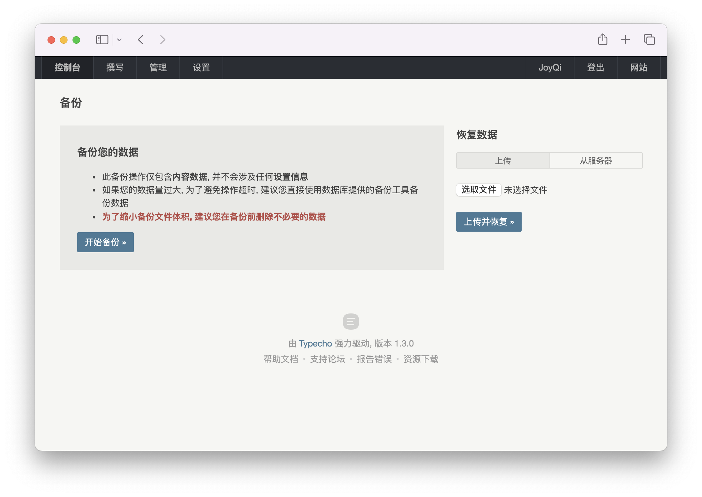

# 备份

在站点管理员执行升级、迁移、修复等危险操作之前，我们都建议备份数据。

## `usr` 目录

一般来说 `usr` 目录下的文件是用户自己上传的文件，例如主题、插件、附件等，这些文件是用户自己上传的，不会随着 Typecho 的升级而被覆盖，所以不需要备份。

但如果你要迁移站点，或者要升级 Typecho 的版本，我们建议你备份 `usr` 目录。

备份 `usr` 目录的方法有很多种，例如使用 `tar` 命令打包成压缩包：

```bash
tar -czvf usr.tar.gz /path/to/typecho/usr
```

## 数据库

Typecho 的数据存储在数据库中，所以我们需要备份数据库。

### 通过「备份」功能备份数据库

在 Typecho 的后台有一个备份数据库的功能，你可以在后台的「控制台」-「备份」中备份数据库。



点击 <kbd>开始备份</kbd> 按钮，Typecho 会自动备份数据库，并生成一个后缀为 `.dat` 的备份文件自动下载。请妥善保管这个备份文件，后续你也可以通过这个备份文件恢复数据。

:::warning
「备份」功能备份的数据仅包含主程序的数据，如果你使用的第三方插件有自己的数据表，这些数据表的数据不会被备份。如果你要备份这些数据，请参考下面的方法。
:::

### 使用第三方工具备份数据库

如果你想备份整个数据库，包括 Typecho 的数据表和第三方插件的数据表，你可以使用第三方工具，例如 `mysqldump` 命令：

```bash
mysqldump -u username -p database_name > backup.sql
```

这个命令会将 `database_name` 数据库的数据导出到 `backup.sql` 文件中。

:::tip
`mysqldump` 命令需要输入数据库的密码，如果你不想在命令行中输入密码，可以使用 `--password` 参数：

```bash
mysqldump -u username -p --password=your_password database_name > backup.sql
```
:::
