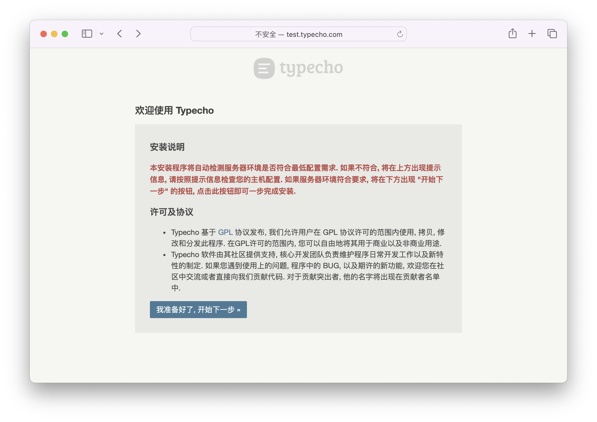

# 安装

## 环境要求

如果你需要直接在服务器上安装 Typecho，你需要确保你的服务器满足下面的要求。如果你使用 Docker 安装 Typecho，你可以跳过这一节。

### PHP 运行环境

Typecho 是一款基于 PHP 构建的博客程序，最新版本需要运行在 `PHP 7.4` 以上版本。此外，Typecho 还需要以下环境支持：

- [多字节字符串支持(MBString)](https://www.php.net/manual/zh/book.mbstring.php)
- [JSON 支持](https://www.php.net/manual/zh/book.json.php)，_(在 PHP 8.0 以上版本已经默认开启)_
- 如果你使用 MySQL 数据库需要 [mysqli 支持](https://www.php.net/manual/zh/book.mysqli.php) 或 [PDO MySQL 支持](https://www.php.net/manual/zh/book.pdo.php)，_(推荐使用 PDO Mysql 支持)_
- 如果你使用 SQLite 数据库需要 [sqlite3 支持](https://www.php.net/manual/zh/book.sqlite3.php) 或 [PDO SQLite 支持](https://www.php.net/manual/zh/book.pdo.php)，_(推荐使用 PDO SQLite 支持)_
- 如果你使用 PostgreSQL 数据库需要 [pgsql 支持](https://www.php.net/manual/zh/book.pgsql.php) 或 [PDO PostgreSQL 支持](https://www.php.net/manual/zh/book.pdo.php)，_(推荐使用 PDO PostgreSQL 支持)_

:::tip
Typecho 1.2.x 版本可以运行在 `PHP 7.2` 以上版本，而在这之前的版本可以运行在 `PHP 7.0` 以上版本。但是，我们强烈建议你使用 `PHP 7.4` 以上版本，以获得更好的性能和安全性。
:::

### Web 服务器

Typecho 可以运行在任何支持 PHP(或者fastcgi协议) 的 Web 服务器上，包括但不限于：

- [Apache](https://httpd.apache.org/)
- [Nginx](https://nginx.org/)
- [IIS](https://www.iis.net/)
- [Lighttpd](https://www.lighttpd.net/)

:::note
在下面的例子中，我们默认约定 `/srv/www/typecho` 是 Typecho 的安装目录，你需要根据实际情况修改。`typecho.example.com` 是你的域名，你需要根据实际情况修改。
:::

#### Apache 推荐配置

Apache 需要安装 `mod_php` 或者 `mod_fcgid` 模块，同时需要开启 `mod_rewrite` 模块。

假如 Apache 的配置文件在 `/etc/apache2` 目录下，你可以创建 `/etc/apache2/sites-available/typecho.conf` 文件并添加以下配置：

```apacheconf
<VirtualHost *:80>
    ServerName typecho.example.com
    DocumentRoot /srv/www/typecho
    <Directory /srv/www/typecho>
        Options FollowSymLinks
        AllowOverride Limit Options FileInfo
        DirectoryIndex index.php
        Require all granted
    </Directory>
    <Directory /srv/www/typecho/usr>
        Options FollowSymLinks
        Require all granted
    </Directory>
    <Directory "/srv/www/typecho/var">
      Options -Indexes -FollowSymLinks
      Require all granted
    </Directory>
    <FilesMatch "\.(htaccess|htpasswd|config\.inc\.php)$">
      Require all denied
    </FilesMatch>
    <IfModule mod_rewrite.c>
        RewriteEngine On
        RewriteBase /
        RewriteCond %{REQUEST_FILENAME} !-f
        RewriteCond %{REQUEST_FILENAME} !-d
        RewriteRule . /index.php [L]
    </IfModule>
</VirtualHost>
```

#### Nginx 推荐配置

假如 Nginx 的配置文件在 `/etc/nginx` 目录下，你可以创建 `/etc/nginx/sites-available/typecho.conf` 文件并添加以下配置：

```nginx
server {
    listen 80;
    server_name typecho.example.com;
    root /srv/www/typecho;
    index index.php;
    location / {
        try_files $uri $uri/ /index.php?$args;
    }
    location ~ \.php$ {
        try_files $uri =404;
        include fastcgi_params;
        # 这里需要根据实际情况修改
        fastcgi_pass unix:/var/run/php/php7.4-fpm.sock;
        fastcgi_param SCRIPT_FILENAME $document_root$fastcgi_script_name;
        fastcgi_param SCRIPT_NAME $fastcgi_script_name;
    }
}
```

:::warning
这里的 `fastcgi_pass` 需要根据实际情况修改，确保 Nginx 能够正确连接到 PHP-FPM。
:::

### 数据库

Typecho 支持以下数据库：

- [MySQL](https://www.mysql.com/)，_(推荐使用 MySQL 5.7 以上版本)_
- [PostgreSQL](https://www.postgresql.org/)，_(推荐使用 PostgreSQL 9.6 以上版本)_
- [SQLite](https://www.sqlite.org/)，_(推荐使用 SQLite 3.8 以上版本)_

:::note
我们同时支持 MySQL 的其它分支，比如 MariaDB 和 Percona Server。但是，我们强烈建议你使用 MySQL 官方的版本，以获得更好的兼容性和性能。
:::

## 启动服务

import Tabs from '@theme/Tabs';
import TabItem from '@theme/TabItem';

<Tabs defaultValue="docker" groupId="install">
  <TabItem value="server" label="从服务器安装">

从 [Typecho 的官方网站](https://typecho.org/download) 下载最新版本的 Typecho。

```bash
wget https://github.com/typecho/typecho/releases/latest/download/typecho.zip
```

解压 Typecho 到网页根目录：

```bash
unzip typecho.zip -d /srv/www/typecho
```

  </TabItem>

  <TabItem value="docker" label="从 Docker 安装">

你可以使用 Docker 快速部署 Typecho，只需要运行以下命令：

```bash
docker run -d -p 80:80 --name typecho -v ./typecho:/app/usr -e TYPECHO_SITE_URL=https://[你的域名] -d joyqi/typecho:latest
```

  </TabItem>

  <TabItem value="docker-compose" label="从 Docker Compose 安装">

你可以使用 Docker Compose 快速部署 Typecho，只需要编写以下 `docker-compose.yml` 文件：

```yaml title="docker-compose.yml"
version: '3.8'

services:
  typecho:
    image: joyqi/typecho:latest
    ports:
      - "80:80"
    volumes:
      - ./typecho:/app/usr
    environment:
      - TYPECHO_SITE_URL=https://[你的域名]
    restart: unless-stopped
```

然后运行以下命令：

```bash
docker-compose up -d
```

  </TabItem>
</Tabs>

在浏览器中访问 `https://[你的域名]/install.php`，按照提示完成安装。

## 完成安装

访问上述配置的域名，你将看到 Typecho 的安装界面：



如果一切正常，你将看到 <kbd>我准备好了，开始下一步</kbd> 按钮，点击它继续。

在后续的安装过程中，你需要填写数据库信息、管理员账号信息等，按照提示完成安装。