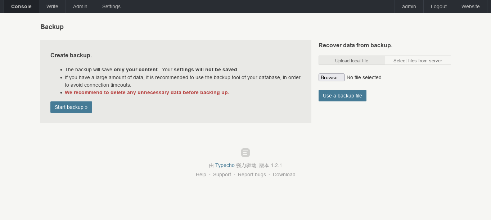

# Backups

We recommend backing up data before site administrators perform risky operations such as upgrades, migrations, repairs, etc.

## `usr` directory

The files in the `usr` directory are, in general, files uploaded by the user themselves, such as themes, plugins, attachments, etc. These files will not be overwritten when you update Typecho, so there is no need to back them up.

However, if you are migrating your site, or if you are upgrading to a major version of Typecho, we recommend that you back up your usr directory.

There are many ways to back up the `usr` directory, such as using the `tar` command to package it into a compressed package:

```bash
tar -czvf usr.tar.gz /path/to/typecho/usr
```

## Database

Typecho stores data in a database, so we need to back it up.

### Back up the database using the "Backup" function

Typecho has a built-in functionality that allows to backup the database. You will find this option in the backend "Console" - "Backup".



Click the <kbd>Start Backup</kbd> button, Typecho will automatically back up the database and generate a backup file with the suffix `.dat` for automatic download. Please keep this backup file in a safe place, and you can also use it to restore data in the future.

:::warning
The data backed up by the "Backup" function only contains the data of the main program, if you use a third-party plug-in with its own data table,
The data from these tables is not backed up. If you want to back up this data, please refer to the method below.
:::

### Back up your database using a third-party tool

If you want to back up the entire database, including Typecho's datasheet and the datatable of third-party plugins, you can use a third-party tool such as `mysqldump`:


```bash
mysqldump -u username -p database_name > backup.sql
```

This command will export the data from the `database_name` database to the `backup.sql` file.

:::tip
`mysqldump` command requires the password for the database. If you don't want to enter your password in the terminal,, you can pass the `--password` parameter (note that this will make the password visible in your command history):

```bash
mysqldump -u username -p --password=your_password database_name > backup.sql
```
:::
