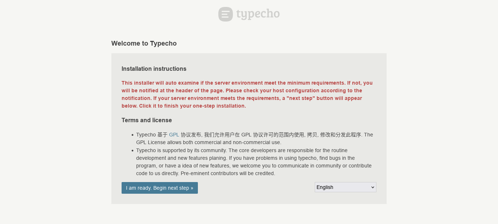

# Installation

## Requirements

If you need to install Typecho directly on your server, youl need to make sure your server meets the requirements below. If you are using Docker to install Typecho, you can skip this section.

### PHP runtime environment

Typecho is a PHP-based blogging program, and the latest version needs to run PHP 7.4 or higher. In addition, Typecho requires the following environment support:

- [Multibyte String support (MBString)](https://www.php.net/manual/book.mbstring.php)
- [JSON support](https://www.php.net/manual/book.json.php) _(enabled by default in PHP 8.0 and above)_
- If you use MySQL, you need [mysqli support](https://www.php.net/manual/book.mysqli.php) or [PDO MySQL support](https://www.php.net/manual/book.pdo.php)，_(PDO Mysql is recommended)_
- If you use SQLite, you need [sqlite3 support](https://www.php.net/manual/book.sqlite3.php) or [PDO SQLite support](https://www.php.net/manual/book.pdo.php)，_(PDO SQLite support is recommended)_
- If you use PostgreSQL you need [pgsql support](https://www.php.net/manual/book.pgsql.php) or [PDO PostgreSQL support](https://www.php.net/manual/book.pdo.php)，_(PDO PostgreSQL support is recommended)_

:::tip
Typecho 1.2.x can run on PHP 7.2 or higher, while previous versions can run on PHP 7.0 or higher. However, we strongly recommend that you use PHP 7.4 or later for better performance and security.
:::

### Web servers

Typecho can run on any web server that supports PHP (or fastcgi protocol), including but not limited to:

- [Apache](https://httpd.apache.org/)
- [Nginx](https://nginx.org/)
- [IIS](https://www.iis.net/)
- [Lighttpd](https://www.lighttpd.net/)

:::note
In the example below, we use the default convention of `/srv/www/typecho` being the installation path of Typecho. You need to modify the path to fit your situation. `typecho.example.com` represents your domain name, you need to change it to your actual domain name.
:::

#### Apache recommended configuration

Apache needs to have installed either the module `mod_php` or `mod_fcgid`. In both cases, the `mod_rewrite` module needs to be installed.

Assuming the Apache configuration file is located in `/etc/apache2`, you can create the file `/etc/apache2/sites-available/typecho.conf` and add the following configuration:

```apacheconf
<VirtualHost *:80>
    ServerName typecho.example.com
    DocumentRoot /srv/www/typecho
    <Directory /srv/www/typecho>
        Options FollowSymLinks
        AllowOverride Limit Options FileInfo
        DirectoryIndex index.php
        Require all granted
    </Directory>
    <Directory /srv/www/typecho/usr>
        Options FollowSymLinks
        Require all granted
    </Directory>
    <Directory "/srv/www/typecho/var">
      Options -Indexes -FollowSymLinks
      Require all granted
    </Directory>
    <FilesMatch "\.(htaccess|htpasswd|config\.inc\.php)$">
      Require all denied
    </FilesMatch>
    <IfModule mod_rewrite.c>
        RewriteEngine On
        RewriteBase /
        RewriteCond %{REQUEST_FILENAME} !-f
        RewriteCond %{REQUEST_FILENAME} !-d
        RewriteRule . /index.php [L]
    </IfModule>
</VirtualHost>
```

#### Nginx recommended configuration

Assuming the Nginx configuration file is located in `/etc/nginx`, you can create the file `/etc/nginx/sites-available/typecho.conf` and add the following configuration：

```nginx
server {
    listen 80;
    server_name typecho.example.com;
    root /srv/www/typecho;
    index index.php;
    location / {
        try_files $uri $uri/ /index.php?$args;
    }
    location ~ \.php$ {
        try_files $uri =404;
        include fastcgi_params;
        # 这里需要根据实际情况修改
        fastcgi_pass unix:/var/run/php/php7.4-fpm.sock;
        fastcgi_param SCRIPT_FILENAME $document_root$fastcgi_script_name;
        fastcgi_param SCRIPT_NAME $fastcgi_script_name;
    }
}
```

:::warning
The `fastcgi_pass` directive here needs to be modified according to your actual system structure, so that Nginx can connect to PHP-FPM correctly.
:::

### Database

Typecho supports the following databases:

- [MySQL](https://www.mysql.com/)，_(recommended version: MySQL 5.7 and above)_
- [PostgreSQL](https://www.postgresql.org/)，_(recommended version: PostgreSQL 9.6 and above)_
- [SQLite](https://www.sqlite.org/)，_(recommended version: SQLite 3.8 and above)_

:::note
We also support other branches of MySQL, such as MariaDB and Percona Server.However, we strongly recommend that you use the official version of MySQL for better compatibility and performance.
:::

## Start the service

import Tabs from '@theme/Tabs';
import TabItem from '@theme/TabItem';

<Tabs defaultValue="docker" groupId="install">
  <TabItem value="server" label="Install from the server">

From [the official website of Typecho](https://typecho.org/download), download the latest version of Typecho:

```bash
wget https://github.com/typecho/typecho/releases/latest/download/typecho.zip
```

Unzip Typecho to the root directory of the web server:

```bash
unzip typecho.zip -d /srv/www/typecho
```

  </TabItem>

  <TabItem value="docker" label="Install from Docker">

You can use Docker to quickly deploy Typecho, just run the following command:

```bash
docker run -d -p 80:80 --name typecho -v ./typecho:/app/usr -e TYPECHO_SITE_URL=https://[YOUR DOMAIN NAME] -d joyqi/typecho:latest
```

  </TabItem>

  <TabItem value="docker-compose" label="Install with Docker Compose">

You can use Docker Compose to quickly deploy Typecho, just write the following `docker-compose.yml` file

```yaml title="docker-compose.yml"
version: '3.8'

services:
  typecho:
    image: joyqi/typecho:latest
    ports:
      - "80:80"
    volumes:
      - ./typecho:/app/usr
    environment:
      - TYPECHO_SITE_URL=https://[你的域名]
    restart: unless-stopped
```

Then run the following command:

```bash
docker-compose up -d
```

  </TabItem>
</Tabs>

In your browser, visit `https://[YOUR DOMAIN NAME]/install.php` and follow the prompts to complete the installation.

## Complete the installation

Visit the domain name configured above and you will see the installation interface of Typecho:



If everything is normal, you will see the <kbd>I am ready. Begin next step >></kbd> button; click it to continue.

In the subsequent installation process, you need to fill in the database information, administrator account information, etc., and follow the prompts to complete the installation.
